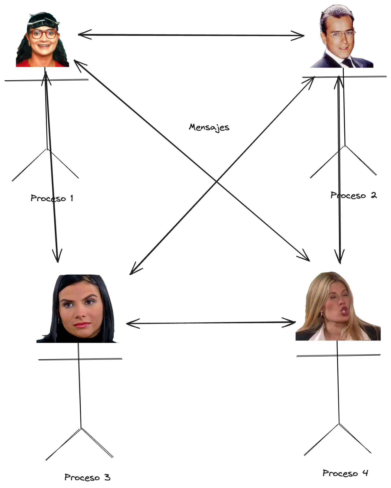

 # Historia de BEAM ecosystem

## Erlang
 es un lenguaje de programación funcional, Dinamico, que corre sobre una maquina virtual (BEAM), diseñado especialmente concurrencia y la alta disponibilidad .
 inventado incialmente para manejar sistemas de telecomunicaciones.   inventado en 1986 por Ericsson.

 
 
 Una de las filosofias con las que se diseño el lenguaje es "let it crash", es decir, los sistemas eventualmente
 fallarán,es casí que imposible manejar todos los errores, entonces lo que hago es isolar el error en un proceso (no confundir con el concepto de proceso del Sistema Operativo),  "matarlo" y 
 volver a comenzar en un estado conocido.

 se han preguntado muchas veces como simplemente apagando y encediendo la computadora se arregla el problema?
 bueno es algo similar.

 ## Elixir
 es un lenguaje de programación funcional inventado en el 2011,que corre sobre la misma maquina virtual de erlang.
 el creador de Elixir, se preocupaba por que no habian casi buenos lenguajes para manejar de manera eficiente y efectiva la concurrencia, por lo que decidio crear Elixir, Es parecido a Erlang, pero con una sintaxis mas amigable y moderna. El creador era core contributor de Ruby on Rails, por lo que Elixir se asemeja en cierta forma a Ruby en cuanto a la sintaxis.

## Otros lenguajes en BEAM
- Gleam (2016) soporte nativo de tipos y compilación a JavaScript
- LFE (2008) Lisp

# Modelo de actores
- Los actores son la unidad basica  de computación.

- Los actores se comunican entre si enviandose mensajes

	- los mensajes son una construccion **LIVIANA** enviar mensajes entre actores
	es casi primitivo.

- Se puede generar algo en el otro actor si le respondemos, enviamos algun mensaje.  (no responder puede ser una respuesta)
	
	

- introducir nuevos actores es muy barato en terminos computacionales (a diferencia de en la vida real)

- todos se pueden enviar mensajes entre todos, al fin y al cabo cada actor es un proceso.

## De eso tan bueno no dan tanto....
- No es una bala de plata
- puede ser muy bueno para manejar un servidor de videojuegos mas no para escribir un videojuego [servidor de wow en elixir ](https://pikdum.dev/posts/thistle-tea/)
- hacer paralelismo o concurrencia sobre cualquier problema, no lo va a solucionar mas rapido necesariamente, incluso lo podria hacer mas lento
- escoge la herramienta adecuada para el trabajo adecuado, o incluso combina varias herramientas para lograr el mejor resultado posible
- han creado una herramienta de modelo 3d 🤯  [wings 3d](https://www.wings3d.com)
- No es particularmente bueno en procesamiento de señales (audio o imagenes), escribir drivers de sistema operativos, en general cosas que requieran muy bajo nivel, y operaciones de alto rendimiento en el espacio numerico, aunque se esta haciendo un esfuerzo para cambiar esto, en especial en el mundo de machine learning.

	

# Casos de uso
## Whatsapp
En 2016, WhatsApp alcanzó más de mil millones de usuarios y tenía las siguientes estadísticas de carga:
42 mil millones de mensajes enviados diariamente
1.6 mil millones de imágenes enviadas diariamente
250 millones de videos enviados diariamente

Estan fuertemente Escritos con OTP (Open Telecom Platform), que es como la "biblioteca estandar" para construir aplicaciones robustas, escalables y tolerantes al fallo

## Discord
Desde el principio, Discord ha sido un adoptante temprano de Elixir. La máquina virtual de Erlang era el candidato perfecto para el sistema altamente concurrente y en tiempo real que estábamos buscando construir.

## Bancolombia for the win (algún día)
Experiencia propia, un dia dieron le pagaron a una entidad especializada en Elixir/erlang para dar una charlita a la cual asistí, de igual sus repos tienen proyectos de elixir para la comunidad

(ejemplo)[https://github.com/bancolombia/distributed-performance-analyzer]
(Async DataFlow)[https://github.com/bancolombia/async-dataflow]
entregar respuestas asíncronas en tiempo real a las aplicaciones cliente

## Helium
Blockchain que opera principalmente en Iot Devices, y la gran parte de su core esta escrito en elixir

## Sonic Pi
Programa para hacer música con codigo. el "orquestador de instrumentos" está escrito en elixir

## Farmbot
FarmBot es un proyecto de agricultura de precisión CNC de código abierto que incluye una máquina robótica agrícola, software y documentación, incluyendo un repositorio de datos agrícolas. Las máquinas de FarmBot utilizan tecnología IoT para facilitar a los agricultores la gestión remota de sus jardines.

# Frameworks
## Phoenix/Ash
## Phoenix
 "Fullstack" framework para web
## Ash 
Es un framework "OPINIONADO" para construir tu capa de aplicación, independiente de cómo se expone o consume. No es una alternativa a frameworks como Phoenix, sino más bien un complemento para ellos.

## Machine Learning
### NX
Nx es el proyecto que inició todo. Juega un papel similar al de Numpy dentro de la comunidad de Elixir, con soporte para compilación justo a tiempo (JIT) tanto para CPUs como para GPUs

### Explorer
Dataframes para Elixir

### Scholar
enfocado en técnicas tradicionales de aprendizaje automático (scikit-learn).

### NERVES
Framework para sistemas embebidos.

# Syntaxs
todo es funciones y modules, listas, tuplas, mapas, coneccion a c

# Recursos interactivos

[curso completo self paced de programacion funcional en Elixir](https://www.kth.se/social/course/ID1019/)

[excercism.io](https://exercism.io/tracks/elixir)

# Recursos
[Learn You Some Erlang for Great Good!](https://learnyousomeerlang.com/introduction#what-is-erlang)
[let it crash philosophy](https://www.youtube.com/watch?v=sz3tMPkl5hI)
[elixir documentary](https://www.youtube.com/watch?v=lxYFOM3UJzo)
[programs as people](https://leftoversalad.com/c/015_programmingpeople/)

[whats app](How WhatsApp scaled to 1 billion users with only 50 engineers)

[discord](https://discord.com/blog/how-discord-scaled-elixir-to-5-000-000-concurrent-users)

[helium](https://docs.helium.com/faq/open-source/)

[phoenix](https://www.phoenixframework.org)

[ash](https://hexdocs.pm/ash/what-is-ash.html)

[nerves](https://nerves-project.org)

[concurrency and ai by josevalim](https://www.youtube.com/watch?v=pas9WdWIBHs)

